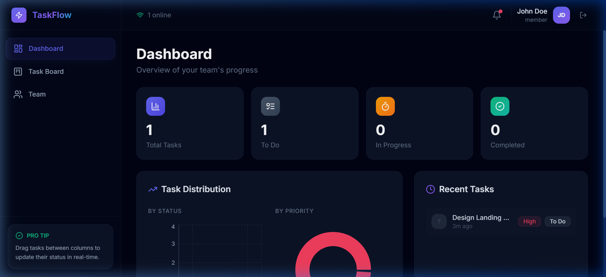
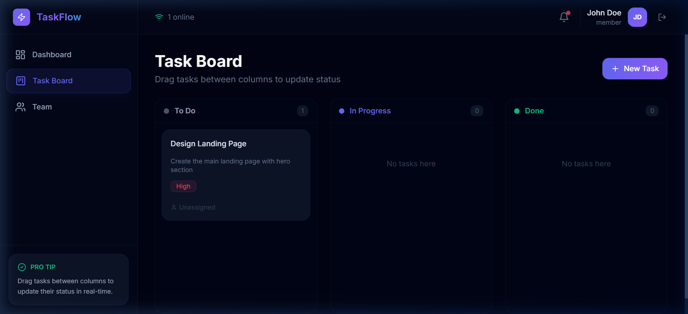
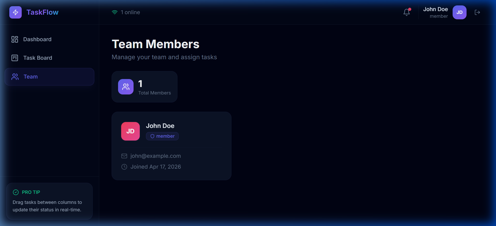

# TaskFlow — Real-Time Multi-Team Task Management

A production-ready, real-time collaborative task management system featuring **Multi-Team Workspace Support**. Built with React, Node.js, Express, MongoDB, and Socket.io.

## 🔗 Live Demo

- **Frontend Application**: [https://task-manager-theta-ten-91.vercel.app/](https://task-manager-theta-ten-91.vercel.app/)
- **Backend API**: [https://task-manager-2cny.onrender.com/api](https://task-manager-2cny.onrender.com/api)

---

## 🚀 Key Features

### 🌟 1. Multi-Team Workspaces
- Users can belong to multiple teams (workspaces) simultaneously.
- **Workspace Switcher**: Seamlessly switch between different team contexts from the sidebar.
- **Join/Create**: Create new workspaces or join existing ones using a unique 8-character invitation code.

### ⚡ 2. Real-Time Collaboration
- **Instant Updates**: All task changes (creation, updates, status changes) sync instantly across all team members in a workspace.
- **Presence Tracking**: See exactly how many members are online in your current workspace at any moment.
- **Notifications**: Real-time toast notifications for task assignments and completions.

### 📋 3. Kanban Task Management
- **Dashboard**: High-level overview with statistics cards and distribution charts (Recharts).
- **Drag & Drop Logic**: Manage workflows by moving tasks between columns (To Do → In Progress → Done).
- **Task Assignment**: Assign tasks with priority levels and due dates.

### 🛡️ 4. Security & Performance
- **JWT Auth**: Secure authentication and authorization flow.
- **Multi-Tenant Isolation**: Strict data segregation ensuring users only see tasks from their active workspace.
- **Responsive & Dark UI**: Premium glassmorphism-based dark theme optimized for all devices.

---

## 📸 Screenshots

| Dashboard Overview | Kanban Task Board |
|:---:|:---:|
|  |  |

| Team Management | Workspace Switching |
|:---:|:---:|
|  | *Manage multiple workspaces easily* |

---

## 📦 Tech Stack

- **Frontend**: React 18, Vite, Lucide Icons, Recharts, Axios, React Hot Toast
- **Backend**: Node.js, Express, Socket.io
- **Database**: MongoDB (Mongoose)
- **Deployment**: Vercel (Frontend), Render (Backend)

---

## 🛠️ Local Installation

### Backend
1. `cd backend`
2. `npm install`
3. Create `.env` file from the following template:
   ```
   PORT=5000
   MONGODB_URI=your_mongo_uri
   JWT_SECRET=your_secret
   CLIENT_URL=http://localhost:5173
   ```
4. `npm run dev`

### Frontend
1. `cd frontend`
2. `npm install`
3. Create `.env` file:
   ```
   VITE_API_URL=http://localhost:5000/api
   ```
4. `npm run dev`

---

## 📡 API Architecture

| endpoint | action |
|---|---|
| `/api/auth/signup` | Register with auto-workspace creation |
| `/api/auth/login` | Secure login |
| `/api/auth/me` | Fetch profile with populated workspace details |
| `/api/auth/switch-team/:id` | Change the active workspace context |
| `/api/auth/join-team` | Join a team via invite code |
| `/api/tasks` | Workspace-specific task operations |
| `/api/users` | List members of the current active workspace |

---

## 👤 Author
Developed as part of an Internship Project focused on Real-Time Agentic Multi-Tenant systems.
